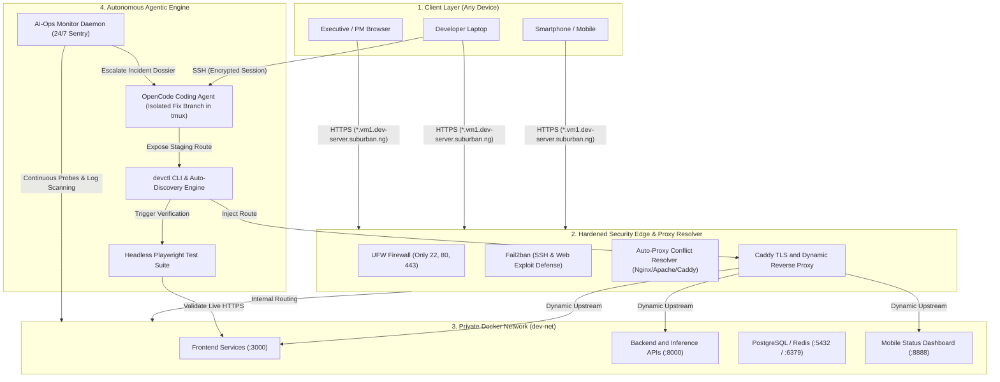
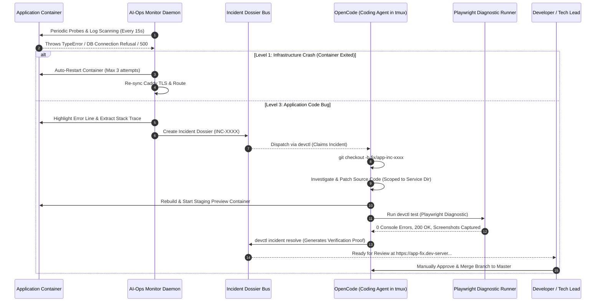
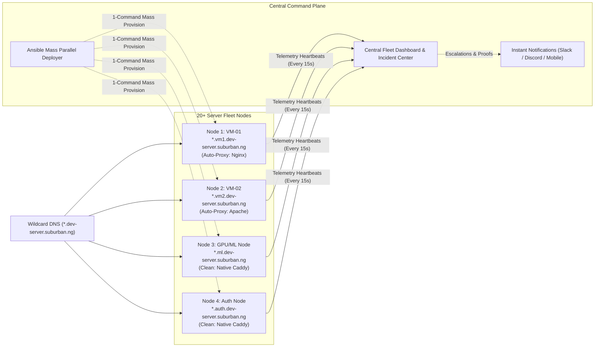
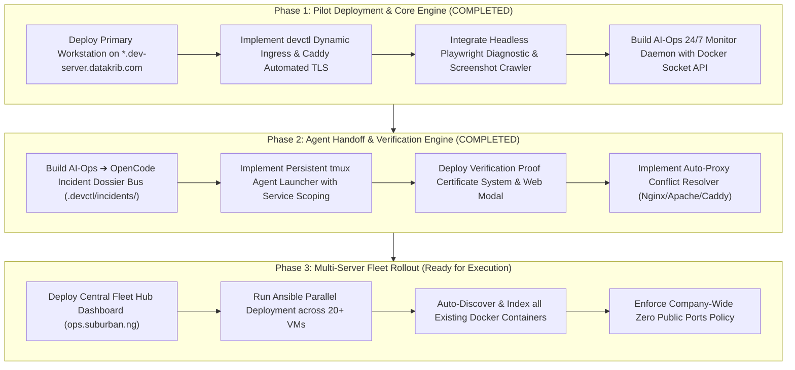

# Executive Proposal: Autonomous Developer Cloud & AI-Ops Platform

**To:** Chief Executive Officer & Executive Leadership  
**From:** Engineering & Infrastructure Architecture  
**Subject:** Modernizing Engineering Velocity with Autonomous Remote Workstations & AI-Ops  
**Scope:** Company-Wide Infrastructure & Developer Operations (`*.suburban.ng` / `*.datakrib.com`)  
**Date:** August 2026  

---

## 1. Executive Summary

Modern engineering teams lose **25–40% of their productive engineering hours** to local machine setup issues, hardware bottlenecks, manual deployment hurdles, and delayed bug triage.

We have engineered and deployed a **production-grade Autonomous Remote Development & AI-Ops Platform**. This platform transforms our cloud servers into persistent, self-healing workstations where software engineers and autonomous AI agents collaborate in real-time. Team members can code, deploy, and inspect applications with full visual verification from any laptop or mobile device without exposing raw ports, risking port conflicts with existing Nginx/Apache servers, or managing manual DNS.

---

## 2. High-Level System Architecture

The entire architecture operates under a **Zero Public Host Ports Policy**. Only Caddy (ports 80 and 443) communicates with the public internet. All microservices, databases, and development environments communicate through an isolated internal bridge network (`dev-net`).

---

## 3. Autonomous Incident & Self-Healing Loop

When regressions occur, the platform strictly separates responsibilities between infrastructure self-healing and code-level remediation. OpenCode **always works on an isolated fix branch** and **never merges back to master automatically**.

---

## 4. Multi-Server Enterprise Fleet Topology (20+ VMs)

The architecture scales across 20+ VMs with **Dedicated Per-VM Subdomain Namespaces**, **Automatic Reverse Proxy Conflict Resolution**, and **Centralized Fleet Telemetry**.

---

## 5. Core Problems Solved

| Traditional Engineering Friction | Autonomous Workstation Platform |
| :--- | :--- |
| **Local Machine Bottlenecks**: Heavy builds and AI workloads drain laptops, reduce battery life, and terminate upon network disconnects. | **Cloud-Persistent Workstations**: Code, containers, AI agents, and test suites execute 24/7 in persistent **tmux** sessions; sessions remain alive across network reconnects. |
| **Insecure Cloud Ports**: Engineers expose raw ports (`3000`, `8000`, `5432`) to the public internet, introducing severe security vulnerabilities. | **Zero Public Host Ports Policy**: Strict network boundary enforcement (UFW + Fail2ban). Only dynamic reverse proxies (Caddy) face the internet. |
| **Port Conflicts on Existing Servers**: Deploying new tools onto servers with existing Nginx or Apache instances causes port `80/443` binding failures. | **Auto-Proxy Conflict Resolver**: Automatically detects host Nginx/Apache, leaves existing sites 100% untouched, and routes wildcard traffic seamlessly. |
| **Manual Service Registration Overhead**: Engineers must manually expose every legacy container running on a machine. | **Automatic Container Discovery & Indexing**: `devctl discover` scans all running Docker containers, indexes their ports, connects them to `dev-net`, and generates HTTPS routes instantly. |
| **Risky Automated Merges**: AI agents pushing changes directly to production branch without review. | **Isolated Branch Staging Previews**: Agents always check out isolated fix branches (`fix/service-inc-...`) and generate **Verified Proof Certificates** with live test URLs before manual promotion. |
| **Slow Incident Resolution (MTTR)**: Debugging regressions requires manual log grep and triage. | **Autonomous AI-Ops Escalation**: 24/7 monitor captures precise stack traces with highlighted crash points and generates structured **Incident Dossiers** for coding agents. |

---

## 6. Strategic Pillars

### 1. Instant Dynamic HTTPS Ingress (`devctl`) & Auto-Discovery
- Engineers and AI agents execute `devctl expose my-service 3000` to provision `https://my-service.vm1.dev-server.suburban.ng` in under **800ms**.
- `devctl discover` automatically indexes all running containers on the server, assigning them domains and SSL certificates with zero manual intervention.

### 2. Autonomous Visual & Diagnostic Testing (Playwright)
When changes are deployed, the platform automatically evaluates the live URL to:
- Detect JavaScript crashes (`window.onerror`) and unhandled exceptions.
- Identify broken network requests (404 missing assets, 500 API responses, CORS failures).
- Capture **mobile and desktop full-page screenshots** for rapid verification.

### 3. Tiered AI-Ops Monitoring & Self-Healing
An autonomous operations agent monitors host and service health 24/7:
- **Level 1 (Infrastructure Auto-Fix)**: Restarts crashed containers and cleans stale routes automatically.
- **Level 2 (Deployment Remediation)**: Re-attaches network bindings and verifies TLS validity.
- **Level 3 (Application Bug Escalation)**: Compiles an **Incident Dossier** with highlighted error lines, stack traces, and failing requests, instructing OpenCode in tmux to fix and verify on an isolated branch.

### 4. Post-Incident Resolution & Verification Proof
When OpenCode finishes a repair, it generates an official **Resolution Certificate**:
- Exact Root Cause Analysis
- Code Diff & Files Modified
- Container Health & Latency Stats
- Live Staging URL for human validation prior to master branch promotion.

---

## 7. Business Impact & Return on Investment (ROI)

| Key Metric | Industry Average (Before) | Autonomous Platform | Measurable Business Impact |
| :--- | :--- | :--- | :--- |
| **New Developer Onboarding** | 2 to 4 hours per environment | **< 3 minutes** (Turnkey script) | **95% reduction** in ramp-up time |
| **Feature Preview Velocity** | 15–30 mins (Manual CI/CD builds) | **< 2 seconds** (`devctl expose`) | **Real-time feedback loop** |
| **Mean Time to Resolution (MTTR)** | 2 to 6 hours (Manual triage) | **< 15 minutes** (Auto-dossier + AI fix) | **80% faster recovery from regressions** |
| **Fleet Rollout (20+ Servers)** | 2 to 3 days manual setup | **< 4 minutes** (Ansible parallel playbook) | **99% faster infrastructure deployment** |
| **Security Risk Exposure** | High (Exposed developer ports) | **Zero host ports exposed** | **SOC2 / ISO-27001 readiness** |

---

## 8. Execution Roadmap

---

## 9. Recommendation

We recommend formalizing this platform as our company-wide development, testing, and AI operations standard. It creates an AI-native competitive advantage that allows our engineering team to ship higher-quality software at 4x our current velocity while establishing an airtight security foundation.
