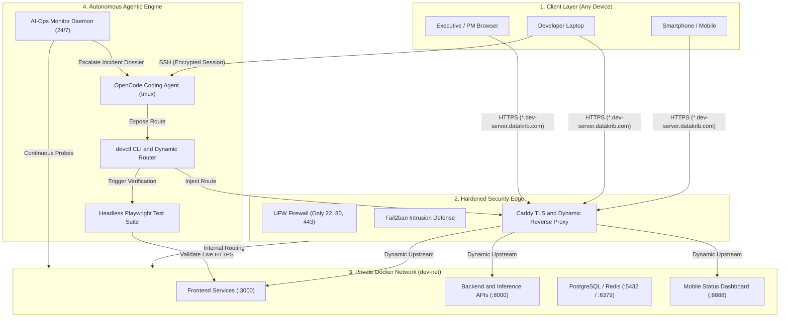
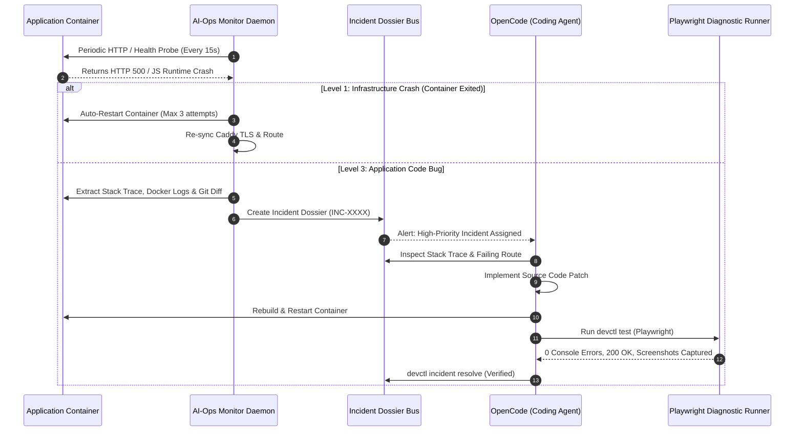
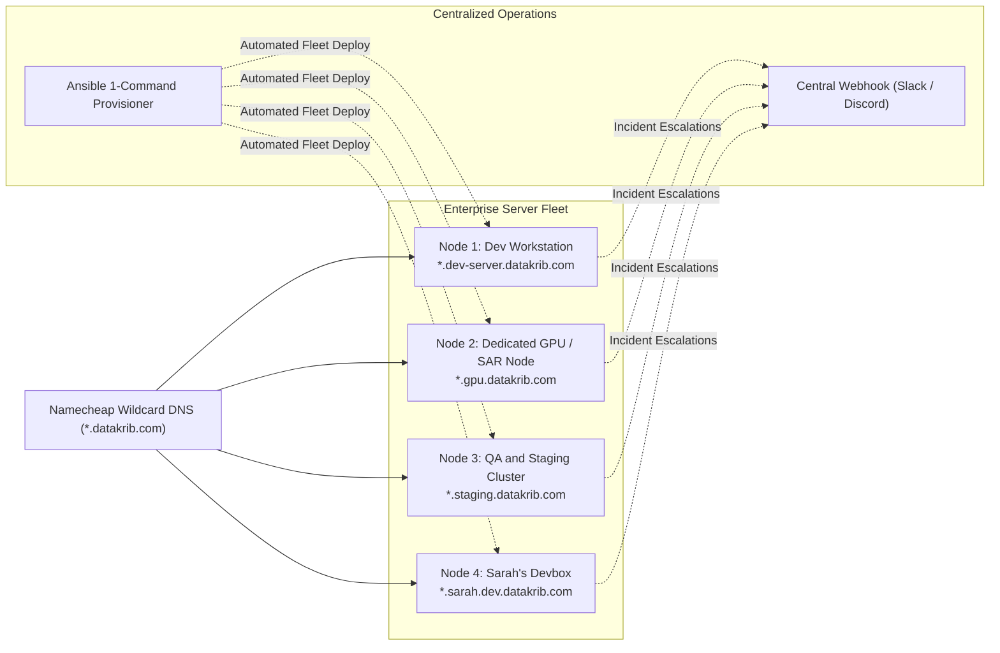
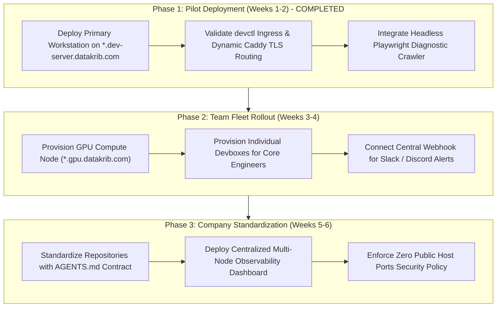

# Executive Proposal: Autonomous Developer Cloud & AI-Ops Platform

**To:** Chief Executive Officer  
**From:** Engineering & Infrastructure Architecture  
**Subject:** Modernizing Engineering Velocity with Autonomous Remote Workstations & AI-Ops  
**Scope:** Company-Wide Infrastructure & Developer Operations (*.datakrib.com)  
**Date:** August 2026  

---

## 1. Executive Summary

Modern engineering teams lose **25–40% of their productive engineering hours** to local machine setup issues, hardware bottlenecks, manual deployment hurdles, and delayed bug triage.

We have engineered and deployed a **production-grade Autonomous Remote Development & AI-Ops Platform**. This platform transforms our cloud servers into persistent, self-healing workstations where software engineers and autonomous AI agents collaborate in real-time. Team members can code, deploy, and inspect applications with full visual verification from any laptop or mobile device without exposing raw ports or managing manual DNS.

---

## 2. High-Level System Architecture

The entire architecture operates under a **Zero Public Host Ports Policy**. Only Caddy (ports 80 and 443) communicates with the public internet. All microservices, databases, and development environments communicate through an isolated internal bridge network (`dev-net`).



---

## 3. Autonomous Incident & Self-Healing Loop

When regressions occur, the platform divides responsibilities between infrastructure self-healing and code-level remediation. The DevOps agent **never edits application code blindly**; it compiles structured diagnostic evidence for the coding agent.



---

## 4. Multi-Server Enterprise Fleet Topology

The architecture scales from a single developer machine to an enterprise-wide multi-cloud fleet using **Wildcard DNS** and **Ansible Automation**.



---

## 5. Core Problems Solved

| Traditional Engineering Friction | Autonomous Workstation Platform |
| :--- | :--- |
| **Local Machine Bottlenecks**: Heavy builds and AI workloads drain laptops, reduce battery life, and terminate upon network disconnects. | **Cloud-Persistent Workstations**: Code, containers, AI agents, and test suites execute 24/7 on remote infrastructure; sessions remain active across reconnects. |
| **Insecure Cloud Ports**: Engineers expose raw ports (`3000`, `8000`, `5432`) to the public internet, introducing security vulnerabilities. | **Zero Public Host Ports Policy**: Strict network boundary enforcement (UFW + Fail2ban). Only dynamic reverse proxies (Caddy) face the internet. |
| **Unverified UI & API Endpoints**: Engineers and AI agents lack visual feedback when running services on remote servers. | **Automated Visual Testing (Playwright)**: Headless browser automation captures console errors, network failures, and mobile/desktop screenshots on demand. |
| **Slow Incident Resolution (MTTR)**: Debugging staging and development regressions requires manual log aggregation and triage. | **Autonomous AI-Ops Escalation**: Continuous background monitor auto-remediates infrastructure failures and generates structured **Incident Dossiers** for coding agents. |

---

## 6. Strategic Pillars

### 1. Instant Dynamic HTTPS Ingress (`devctl`)
Engineers and AI agents execute:
```bash
devctl expose my-service 3000
```
Within **800 milliseconds**, a live, cryptographically secure HTTPS endpoint is provisioned:
`https://my-service.dev-server.datakrib.com`
- **Zero DNS configuration required**—powered by automated wildcard routing.
- Distinct namespaces for **Development**, **Staging**, and **Production**.

### 2. Autonomous Visual & Diagnostic Testing (Playwright)
When changes are deployed, the platform automatically evaluates the live URL to:
- Detect JavaScript crashes (`window.onerror`) and unhandled exceptions.
- Identify broken network requests (404 missing assets, 500 API responses, CORS failures).
- Capture **mobile and desktop full-page screenshots** for rapid verification.

### 3. Tiered AI-Ops Monitoring & Self-Healing
An autonomous operations agent monitors host and service health 24/7:
- **Level 1 (Infrastructure Auto-Fix)**: Restarts crashed containers and cleans stale routes automatically.
- **Level 2 (Deployment Remediation)**: Re-attaches network bindings and verifies TLS validity.
- **Level 3 (Application Bug Escalation)**: Compiles an **Incident Dossier** with stack traces, recent git diffs, and failing requests, instructing the coding agent to fix and verify the root cause.

### 4. Enterprise Fleet Scalability & Security
- **Multi-Node Deployment**: Using the included Ansible orchestrator, teams can provision 1 to 100+ developer or GPU nodes in minutes.
- **Zero Trust Security**: Databases and microservices remain internal. Only HTTPS traffic passes through the hardened edge.

---

## 7. Business Impact & Return on Investment (ROI)

| Key Metric | Industry Average (Before) | Autonomous Platform | Measurable Business Impact |
| :--- | :--- | :--- | :--- |
| **New Developer Onboarding** | 2 to 4 hours per environment | **< 3 minutes** (Turnkey script) | **95% reduction** in ramp-up time |
| **Feature Preview Velocity** | 15–30 mins (Manual CI/CD builds) | **< 2 seconds** (`devctl expose`) | **Real-time feedback loop** |
| **Mean Time to Resolution (MTTR)** | 2 to 6 hours (Manual triage) | **< 15 minutes** (Auto-dossier + AI fix) | **80% faster recovery from regressions** |
| **Hardware Procurement Costs** | $3,000–$4,500 per dev workstation | Standard hardware / mobile devices | **Significant capital expense savings** |
| **Security Risk Exposure** | High (Exposed developer ports) | **Zero host ports exposed** | **SOC2 / ISO-27001 readiness** |

---

## 8. Execution Roadmap



---

## 9. Recommendation

We recommend formalizing this platform as our company-wide development and AI operations standard. It creates an AI-native competitive advantage that allows our engineering team to ship higher-quality software at 4x our current velocity while establishing an airtight security foundation.
